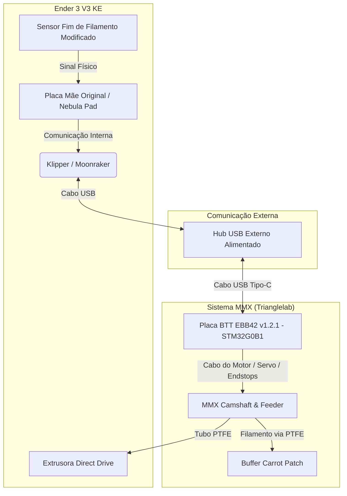
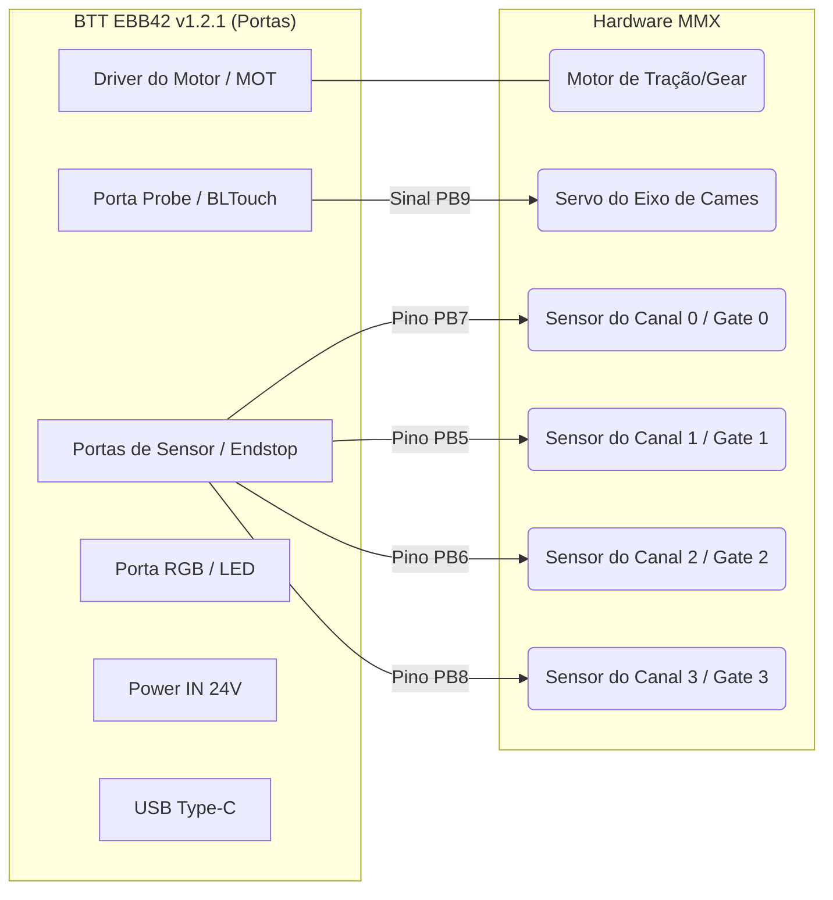

# 📘 Manual de Engenharia: Integração MMX (Trianglelab) na Ender 3 V3 KE

Este documento descreve detalhadamente todos os passos físicos, elétricos e de software para instalar o Sistema MMX (4 Cores) na Creality Ender 3 V3 KE, controlando-o através de uma placa externa **BTT EBB42 v1.2.1** e do ecossistema Happy Hare.

> [!IMPORTANT]
> **Aviso de Engenharia:** Este procedimento envolve modificações críticas na estrutura física e no firmware da impressora. Siga a ordem estabelecida para garantir o isolamento de falhas durante a calibração.

---

## 🏗️ 1. Arquitetura do Sistema

O diagrama abaixo ilustra como os componentes de Hardware e Software se comunicam na nossa topologia customizada utilizando a placa EBB42 em modo USB direto:



---

## 🔗 2. Lista de Materiais (BOM) e Links Essenciais

### Hardware & Eletrônica
*   **Impressora:** Creality Ender 3 V3 KE
*   **Sistema Multicor:** [Trianglelab MMX (Set B - 4 Cores)](https://github.com/trianglelab/MMX)
*   **Placa Controladora:** [BigTreeTech EBB42 v1.2.1 (Extruder Board)](https://github.com/bigtreetech/EBB)
*   **Hub USB:** Recomendado Hub USB com alimentação externa ligado na tela Nebula Pad para evitar quedas de tensão na conexão de dados da EBB42 e da impressora.
*   **Alimentação Externa:** Fonte de 24V DC (mínimo 3A) para alimentar a placa EBB42 e os motores/servos.
*   **Módulo Step-Down (DC-DC):** Regulador de tensão (24V para 5V ou 6V) dedicado para alimentar o servo motor do eixo de cames (*camshaft*).
    > [!WARNING]
    > **Aviso de Sobrecarga:** Não alimente o servo diretamente pela saída de 5V da EBB42. O pico de corrente do servo durante as trocas de canal pode queimar o regulador de tensão interno da placa ou causar travamentos no MCU. Utilize o step-down externo.
*   **Tubos PTFE:** Tubos Capricorn ou similares de baixa fricção (diâmetro interno de 2.0mm a 2.5mm).

### Modelos 3D (Pré-requisitos a serem impressos)
*   **Y-Splitter (4 em 1):** Divisor flutuante a ser montado acima do *Direct Drive*.
*   **Carcaça do Toolhead Customizada:** Peça desenhada no Solid Edge para abrigar e realocar o sensor de filamento original para dentro do bloco da extrusora.
*   **Buffer Carrot Patch:** Para armazenar de forma segura o filamento que sofre recuo (*unload*) durante a troca de cores.
*   **Bandeja Inferior Customizada:** Gaveta integrada para acomodar a EBB42 e o step-down ([mmx-ebb-42-and-stepdown-slide-tray.stl](file:///G:/Meu%20Drive/MMX-Ender%203/mmx-multi-material-extruder-exclusive-final-release-model_files/mmx-ebb-42-and-stepdown-slide-tray.stl)).

### Softwares e Scripts Úteis
*   [Guilouz Creality Helper Script](https://github.com/Guilouz/Creality-Helper-Script): Script base para fazer o "Root" seguro do Creality OS.
*   [Happy Hare (V2/V3)](https://github.com/moggieuk/Happy-Hare): O principal ecossistema e firmware do Klipper para controle de MMUs e troca de filamentos.

---

## 💻 3. Preparação do Software da Ender 3 V3 KE (Root)

A KE de fábrica roda um sistema bloqueado (Creality OS). O primeiro passo real é "libertar" a impressora para termos acesso total ao Klipper.

### Passo 3.1: Habilitar o Root no Display
1. Ligue a KE e garanta que ela está na rede Wi-Fi.
2. Anote o endereço IP (ex: `192.168.1.15`).
3. Vá em **Configurações (Settings) > Rede (Network)**, role a tela e selecione **Root**.
4. Aceite os termos (demora cerca de 30 segundos). A senha de acesso root padrão é `creality`.

### Passo 3.2: Acesso SSH e Instalação do Klipper Limpo
1. No seu PC Windows, abra o PowerShell ou o PuTTY.
2. Digite o comando SSH:
   ```bash
   ssh root@<IP_DA_IMPRESSORA>
   ```
3. A senha é `creality`.
4. Instale o Script do Guilouz:
   ```bash
   git clone https://github.com/Guilouz/Creality-Helper-Script.git /usr/data/helper-script
   sh /usr/data/helper-script/helper.sh
   ```
5. Dentro do menu do script (Menu `1 - Install`), instale:
   *   **Mainsail** e/ou **Fluidd** (Interface Gráfica)
   *   **Moonraker** (A API do Klipper)
   *   **Entware** (Necessário para baixar pacotes extras)

> [!TIP]
> Após finalizar, digite o IP da impressora no navegador. A interface do Mainsail deve aparecer, dando controle total aos arquivos `printer.cfg`.

---

## ⚡ 4. Preparação da Placa Externa (BTT EBB42 v1.2.1)

O MMX será comandado pela placa BTT EBB42 v1.2.1 conectada via USB diretamente à impressora.

### Passo 4.1: Compilar o Firmware no Klipper
No SSH da impressora, compile o Klipper para o processador STM32G0B1:
```bash
cd ~/klipper
make menuconfig
```
Use as seguintes opções na tela azul:
*   **Micro-controller Architecture:** `STMicroelectronics STM32`
*   **Processor model:** `STM32G0B1`
*   **Bootloader offset:** `8KiB bootloader` (Offset padrão para placas BTT EBB42)
*   **Clock Reference:** `8 MHz crystal`
*   **Communication interface:** `USB (on PA11/PA12)`

Salve pressionando `Q` e confirmando com `Y`. Em seguida, compile o arquivo:
```bash
make clean
make
```
O arquivo gerado estará em `~/klipper/out/klipper.bin`.

### Passo 4.2: Gravar o Firmware na Placa (Flash)
1. Use um programa como WinSCP para transferir o arquivo `klipper.bin` para o Windows.
2. Conecte a placa BTT EBB42 via cabo USB Tipo-C ao PC, **segurando o botão físico BOOT** da placa para entrar no modo DFU.
3. Utilize o software **STM32CubeProgrammer**:
   * Selecione a interface de conexão como **USB**.
   * Clique em **Connect** (a placa deve ser reconhecida como um dispositivo DFU).
   * Carregue o arquivo `klipper.bin`.
   * Configure o endereço de gravação (Start Address) como `0x08002000` (correspondente ao offset de 8KiB).
   * Clique em **Start Programming**. Após terminar, desconecte a placa.

---

## 🐰 5. Instalação do Happy Hare

Com o Root feito e a placa pronta, instalamos o software de gerenciamento de trocas de filamento.
Pelo SSH da impressora, execute:
```bash
cd ~
git clone https://github.com/moggieuk/Happy-Hare.git
cd Happy-Hare
./install.sh
```

No instalador interativo:
*   **Escolha o Tipo de MMU:** `Ercf` (O MMX usa a mesma lógica de controle base).
*   **Nome do MCU:** `mmu`
*   **Tipo da Placa Controladora:** Escolha a opção **`BTT EBB 42 CANbus v1.2 (for MMX or Pico)`**. 
    > [!NOTE]
    > Mesmo que estejamos conectando a placa via USB físico direto, esta opção é necessária para carregar automaticamente a biblioteca de mapeamento de pinos correta da EBB42 para o MMX.

O sistema instalará as dependências e criará os arquivos `mmu.cfg` e `mmu_hardware.cfg`.

---

## 🛠️ 6. Modificações de Hardware (Y-Splitter e Sensor)

Como a Ender 3 V3 KE é uma impressora *Direct Drive* (extrusora montada no cabeçote móvel), precisamos de duas peças personalizadas:

1. **Sensor de Visão de Raio-X:** A nova carcaça do cabeçote realoca o sensor óptico de filamento original para ficar o mais próximo possível das engrenagens de tração da extrusora. Isso indica ao Klipper o instante exato em que a ponta entra na zona de *grip*.
2. **Y-Splitter:** Uma peça com 4 entradas de PTFE (uma vinda de cada comporta do MMX) e 1 saída acoplada logo acima desse sensor do cabeçote.

---

## 🔌 7. Diagrama de Cabeamento BTT EBB42 <-> MMX

As conexões elétricas nos pinos da EBB42 v1.2.1 seguirão o mapeamento abaixo:



### Mapeamento Detalhado de Pinos no Klipper
*   **Motor de Passo (Gear/Feeder):** Conectado à porta de motor da EBB42.
    *   `step_pin: mmu:PD0`
    *   `dir_pin: mmu:!PD1` (verifique a direção de rotação e retire o `!` se necessário)
    *   `enable_pin: mmu:!PD2`
    *   `uart_pin: mmu:PA15` (driver TMC2209 integrado)
*   **Servo Motor (Eixo de Cames/Camshaft):** Fio de sinal conectado ao pino **`mmu:PB9`** (pino de controle da porta Probe/BLTouch).
    *   *Lembrete:* Alimente o positivo e negativo do servo através do step-down regulado a 5V/6V, compartilhando o terra (GND) com a placa.
*   **Sensores Fim de Curso de Entrada (Gates 0 a 3):**
    *   **Gate 0 (Canal 0):** `mmu:PB7`
    *   **Gate 1 (Canal 1):** `mmu:PB5`
    *   **Gate 2 (Canal 2):** `mmu:PB6`
    *   **Gate 3 (Canal 3):** `mmu:PB8`
*   **LED de Status RGB (Opcional):** Conectado na porta RGB da placa (pino `mmu:PD3`).

---

## ⚙️ 8. Ajuste de Configurações das Macros no Klipper

No arquivo `mmu_parameters.cfg` gerado pelo Happy Hare, configure as distâncias físicas e controle da ponta do filamento (*Tip Shaping*):

```ini
[mmu]
# A distância exata entre o sensor realocado no cabeçote e o bico (medido na prática).
toolhead_sensor_to_nozzle: 45.0

# Obriga o Klipper a fazer o recuo e esfriar o filamento
# para moldar a ponta sem formar fiapos antes de puxar de volta pro buffer.
force_form_tip_standalone: True
```

No arquivo `mmu_hardware.cfg`, configure a declaração da placa e os pinos do motor e sensores:

```ini
[mcu mmu]
serial: /dev/serial/by-id/usb-Klipper_stm32g0b1xx_...-if00 # Substitua pelo ID real obtido via SSH

[tmc2209 manual_stepper gear_stepper]
uart_pin: mmu:PA15
run_current: 0.800
hold_current: 0.100

[manual_stepper gear_stepper]
step_pin: mmu:PD0
dir_pin: !mmu:PD1
enable_pin: !mmu:PD2
# ... (demais configurações de velocidade/passos padrão do MMX)

[servo mmu_servo]
pin: mmu:PB9
maximum_servo_angle: 180
minimum_pulse_width: 0.0005
maximum_pulse_width: 0.0025

# Mapeamento dos sensores de entrada (pre-gate)
# Verifique o formato exato na versão do Happy Hare instalada
gate_sensor_pins: mmu:PB7, mmu:PB5, mmu:PB6, mmu:PB8
```

---

## 🏁 9. Calibração e Fluxo Final

A ordem oficial de calibração ao energizar o sistema é:

1.  **Descobrir o ID da EBB42:** Conecte a placa no USB do Nebula Pad, acesse via SSH, rode o comando abaixo e insira o ID resultante no `mmu_hardware.cfg`:
    ```bash
    ls /dev/serial/by-id/
    ```
2.  **Calibrar o Seletor de Cames (`MMU_CALIBRATE_SELECTOR`):**
    Como o MMX não usa uma chave limite linear física (endstop) para selecionar as portas (ele usa o eixo de cames rotativo acionado por servo), você deve achar os ângulos do servo para cada canal (0, 1, 2 e 3).
    *   Rode o comando: `MMU_CALIBRATE_SELECTOR ANGLE=X SAVE=0` para testar os ângulos individuais de cada canal até que o ressalto do cames empurre perfeitamente o rolete de pressão do respectivo canal contra a engrenagem tracionadora.
3.  **Calibrar o Feeder (`MMU_CALIBRATE_GEAR`):** Ajusta os passos por milímetro do motor de tração do MMX para empurrar a quantidade exata de filamento demandada.
4.  **Calibrar o Bowden (`MMU_CALIBRATE_BOWDEN`):** Mede o comprimento exato dos tubos PTFE que ligam cada comporta do MMX até o Y-Splitter flutuante no cabeçote.
5.  **Ajuste Fino de Ponta (Tip Shaping):** Realiza testes repetidos de carga e descarga para configurar a temperatura ideal de retração e evitar a formação de fiapos ("cabelo de anjo") no filamento recuado.
