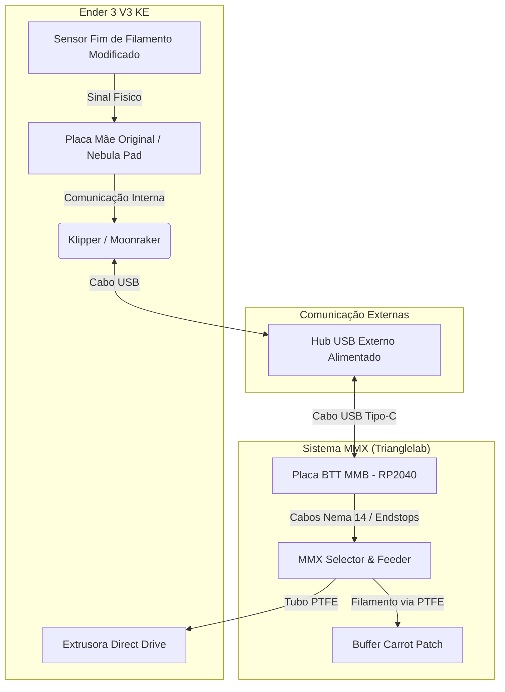
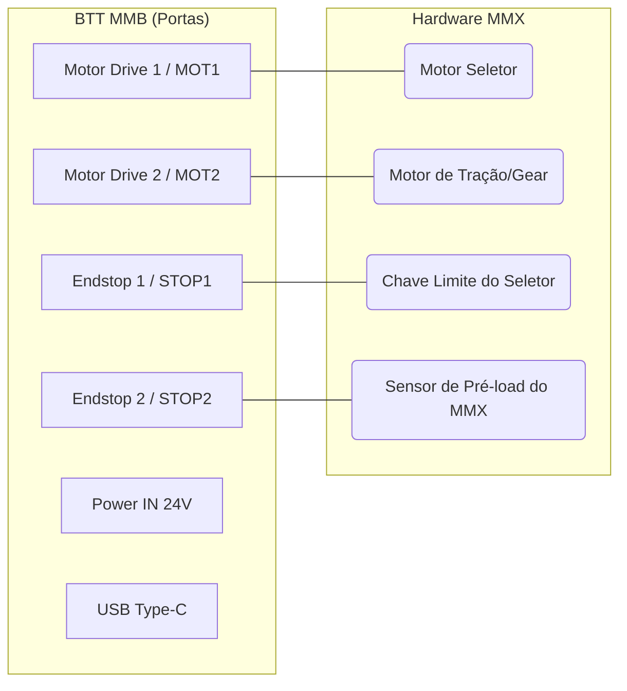

# 📘 Manual de Engenharia: Integração MMX (Trianglelab) na Ender 3 V3 KE

Este documento descreve detalhadamente todos os passos físicos, elétricos e de software para instalar o Sistema MMX (4 Cores) na Creality Ender 3 V3 KE, controlando-o através de uma placa externa BTT MMB e do ecossistema Happy Hare.

> [!IMPORTANT]
> **Aviso de Engenharia:** Este procedimento envolve modificações críticas na estrutura física e no firmware da impressora. Siga a ordem estabelecida para garantir o isolamento de falhas durante a calibração.

## 🏗️ 1. Arquitetura do Sistema

O diagrama abaixo ilustra como os componentes de Hardware e Software se comunicam na nossa topologia customizada:



## 🔗 2. Lista de Materiais (BOM) e Links Essenciais

### Hardware & Eletrônica
*   **Impressora:** Creality Ender 3 V3 KE
*   **Sistema Multicor:** [Trianglelab MMX (Set A - 4 Cores)](https://github.com/trianglelab/MMX)
*   **Placa Controladora:** [BigTreeTech MMB (Multi Material Board)](https://github.com/bigtreetech/MMB)
*   **Hub USB:** Recomendado Hub USB com alimentação externa para ligar na tela Nebula Pad, evitando quedas de tensão.
*   **Tubos PTFE:** Tubos Capricorn ou similares de baixa fricção (diâmetro interno de 2.0mm a 2.5mm).

### Modelos 3D (Pré-requisitos a serem impressos)
*   **Y-Splitter (4 em 1):** Divisor flutuante a ser montado acima do *Direct Drive*.
*   **Carcaça do Toolhead Customizada:** Peça desenhada no Solid Edge para abrigar e realocar o sensor de filamento original para dentro do bloco da extrusora.
*   **Buffer Carrot Patch:** Para armazenar de forma segura o filamento que sofre recuo (*unload*) durante a troca de cores.

### Softwares e Scripts Úteis
*   [Guilouz Creality Helper Script](https://github.com/Guilouz/Creality-Helper-Script): Script base para fazer o "Root" seguro do Creality OS.
*   [Happy Hare (V2)](https://github.com/moggieuk/Happy-Hare): O principal ecossistema e firmware do Klipper para controle de MMUs e troca de filamentos.

---

## 💻 3. Preparação do Software da Ender 3 V3 KE (Root)

A KE de fábrica roda um sistema bloqueado (Creality OS). O primeiro passo real é "libertar" a impressora para termos acesso total ao Klipper.

### Passo 3.1: Habilitar o Root no Display
1. Ligue a KE e garanta que ela está na rede Wi-Fi.
2. Anote o endereço IP (ex: `192.168.1.15`).
3. Vá em **Configurações (Settings) > Rede (Network)**, role a tela e selecione **Root**.
4. Aceite os termos (demora cerca de 30 segundos). A senha de acesso root padrão é `creality`.

### Passo 3.2: Acesso SSH e Instalação do Klipper Limpo
1. No seu PC Windows, abra o PowerShell ou o PuTTY.
2. Digite o comando SSH:
   ```bash
   ssh root@<IP_DA_IMPRESSORA>
   ```
3. A senha é `creality`.
4. Instale o Script do Guilouz:
   ```bash
   git clone https://github.com/Guilouz/Creality-Helper-Script.git /usr/data/helper-script
   sh /usr/data/helper-script/helper.sh
   ```
5. Dentro do menu do script (Menu `1 - Install`), instale:
   *   **Mainsail** e/ou **Fluidd** (Interface Gráfica)
   *   **Moonraker** (A API do Klipper)
   *   **Entware** (Necessário para baixar pacotes extras)

> [!TIP]
> Após finalizar, digite o IP da impressora no navegador. A interface do Mainsail deve aparecer, dando controle total aos arquivos `printer.cfg`.

---

## ⚡ 4. Preparação da Placa Externa (BTT MMB)

O MMX será comandado por esta placa, ligada via USB na impressora.

### Passo 4.1: Compilar o Firmware
No SSH da impressora, compile o Klipper para o processador RP2040:
```bash
cd ~/klipper
make menuconfig
```
Use as seguintes opções na tela azul:
*   **Micro-controller Architecture:** `Raspberry Pi RP2040`
*   **Bootloader offset:** `No bootloader`
*   **Flash chip:** `W25Q080 with CLKDIV 2`
*   **Communication interface:** `USB`

Salve pressionando `Q` e `Y`. Em seguida, compile o arquivo:
```bash
make clean
make
```
O arquivo gerado estará em `~/klipper/out/klipper.uf2`.

### Passo 4.2: Flash da Placa (Instalação)
1. Use um programa como WinSCP para transferir o arquivo `klipper.uf2` para o Windows.
2. Conecte a placa BTT MMB via cabo USB ao PC, **segurando o botão físico BOOT**.
3. O Windows reconhecerá um pendrive chamado "RPI-RP2".
4. Arraste o arquivo `klipper.uf2` para dentro dele. O drive irá sumir. A placa foi atualizada com sucesso!

---

## 🐰 5. Instalação do Happy Hare

Com o Root feito e a placa pronta, instalamos o cérebro das trocas.
Pelo SSH da impressora, rode:
```bash
cd ~
git clone https://github.com/moggieuk/Happy-Hare.git
cd Happy-Hare
./install.sh
```

No instalador interativo:
*   Escolha MMU Type: `Ercf` (O MMX usa a mesma lógica do ERCF).
*   Nome do MCU: `mmu`
O sistema vai instalar as dependências e criar automaticamente o arquivo `mmu.cfg`.

---

## 🛠️ 6. Modificações de Hardware (Y-Splitter e Sensor)

Como a Ender 3 V3 KE é *Direct Drive* (extrusora na cabeça), precisamos de duas modificações que você irá imprimir e instalar:

1. **Sensor de Visão de Raio-X:** A nova carcaça que desenharemos moverá o sensor ótico de filamento para ficar o mais próximo possível das engrenagens de tração. Isso indica à macro exatamente o instante em que a ponta entra na zona de *grip*.
2. **Y-Splitter:** Uma peça com 4 entradas de PTFE e 1 saída acoplada logo acima desse sensor.

---

## 🔌 7. Diagrama de Cabeamento BTT MMB <-> MMX

Com o hardware em mãos, as ligações nos pinos da BTT MMB seguirão esta arquitetura de portas:



---

## ⚙️ 8. Ajuste de Macros Críticas no Klipper

Em impressoras *Direct Drive* sem lâmina de corte embutida, o segredo é a formação da ponta do filamento (*Tip Shaping*).
No arquivo gerado pelo Happy Hare (`mmu_parameters.cfg`), configuraremos:

```ini
[mmu]
# A distância exata entre o sensor realocado e o bico (medido na prática).
toolhead_sensor_to_nozzle: 45.0

# Obrigamos o Klipper a fazer o recuo e esfriar o filamento
# para moldar a ponta sem formar fiapos antes de puxar de volta pro buffer.
force_form_tip_standalone: True
```

---

## 🏁 9. Calibração e Fluxo Final

A ordem oficial de calibração quando tudo for energizado será:
1. **Descobrir o ID da MMB:** Ligar a MMB no USB, rodar `ls /dev/serial/by-id/` e colocar no `mmu.cfg`.
2. **Calibrar o Seletor (`MMU_CALIBRATE_SELECTOR`):** Fazer o MMX achar a posição 0 a 3.
3. **Calibrar o Feeder (`MMU_CALIBRATE_GEAR`):** Ajustar os passos por milímetro do motor empurrador do MMX.
4. **Calibrar o Bowden (`MMU_CALIBRATE_BOWDEN`):** Medir o comprimento exato dos tubos PTFE até o Y-Splitter.
5. **Ajuste Fino de Ponta:** Realizar testes de carga e descarga para achar a temperatura ideal de retração.
